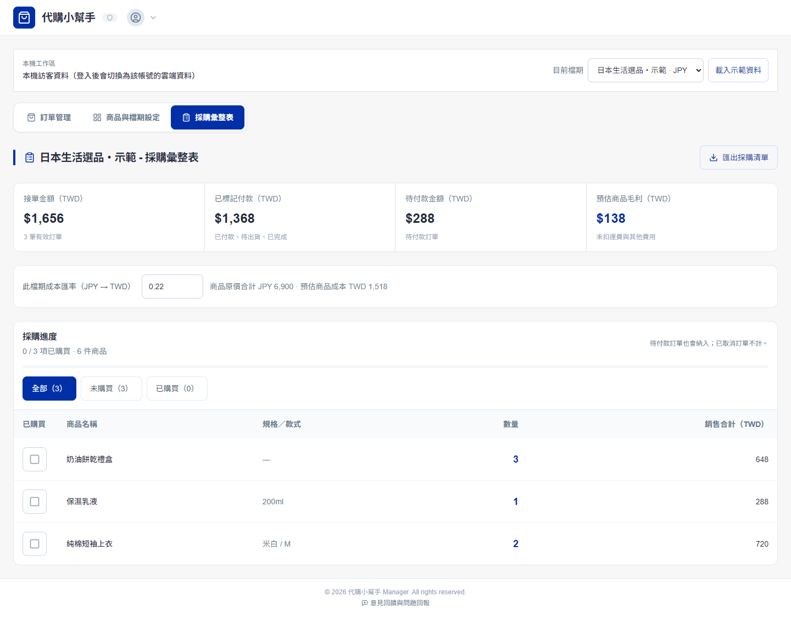
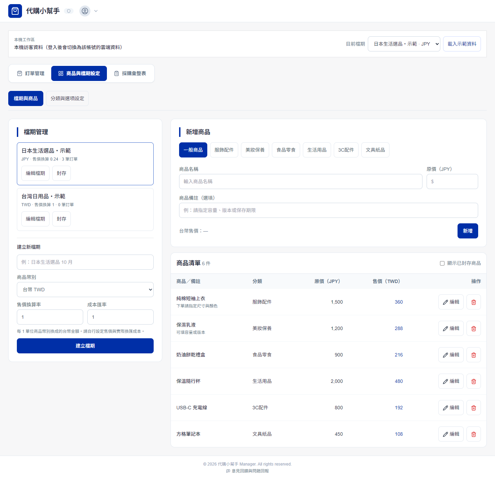
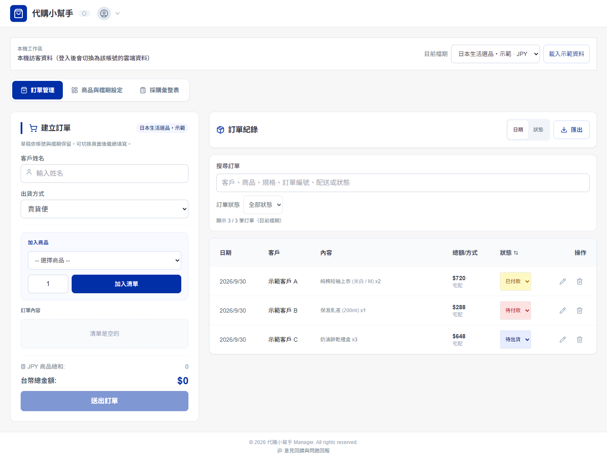
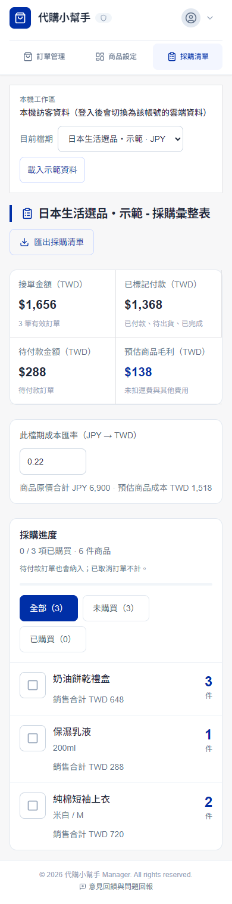
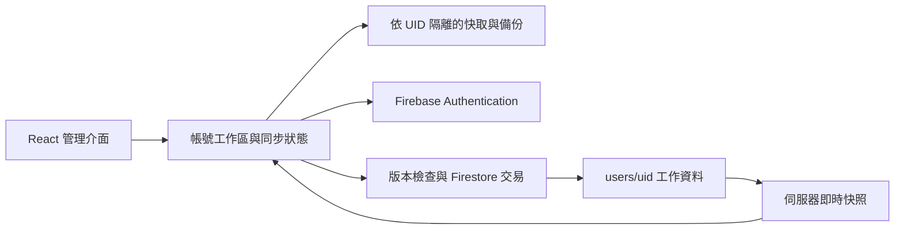

# 代購小幫手｜Daigou Helper

給個人代購與小型接單工作室使用的訂單、商品與採購管理工具。以檔期整理商品與客戶訂單，按款式彙整採購數量，並透過 Google 帳號同步不同裝置的工作資料。

**[線上使用](https://daigo-2d168.web.app)** · **[分類與品項對照](docs/category-mapping.md)** · **[資料相容與同步設計](docs/data-safety.md)** · **[驗證紀錄](docs/validation.md)**

不必登入即可使用本機工作區。點選「載入示範資料」可以體驗一般代購流程；示範客戶、商品和訂單皆為虛構資料，只會寫入訪客工作區。登入後會切換至該帳號的雲端工作區。



## 功能

- **商品與檔期管理**：各檔期獨立設定幣別、售價換算率及成本匯率；可編輯商品名稱、價格、分類與備註。
- **訂單管理**：客戶與配送資訊、自由規格、固定款式選項、數量、付款與出貨狀態；支援多關鍵字搜尋、狀態篩選及 Excel 匯出。
- **草稿續填**：草稿依帳號與檔期隔離，切換頁面、檔期或重新整理後可繼續使用。
- **採購彙整**：依商品與規格合併數量，保存已購買勾選狀態，篩選及匯出已購買／未購買清單。
- **金額摘要**：接單金額、已標記付款、待付款與預估商品毛利分開顯示。毛利只扣商品成本，尚未扣運費與其他費用。
- **資料保護**：有資料的檔期改為封存；刪除使用中的分類須先移轉商品；修改商品不會改動歷史訂單的名稱、規格與成交價。
- **帳號同步**：以 UID 隔離工作區，等待伺服器首次回應後才能編輯，以交易與版本比對攔截覆蓋衝突。
- **備份與相容**：JSON 匯出／匯入、匯入檢查與確認、原始快取下載；保留舊分類與歷史規格，缺少檔期設定的資料仍可查詢及手動修復。

手機使用卡片操作，桌面使用表格；商品分類列支援觸控橫向捲動。

<details>
<summary>更多畫面：商品管理、訂單管理與手機採購</summary>





</details>

## 技術

| 範圍 | 使用技術 |
| --- | --- |
| 前端 | React 18、TypeScript、Vite |
| 介面 | Tailwind CSS、Lucide 圖示 |
| 帳號 | Firebase Authentication／Google 登入 |
| 資料 | Cloud Firestore、localStorage、交易與即時監聽 |
| 匯出 | SheetJS；點選匯出時才載入 Excel 模組 |
| 部署 | Firebase Hosting、Firestore Rules |
| 驗證 | Node.js Test Runner、Playwright、Firebase Auth／Firestore Emulators |
| CI | GitHub Actions：單元測試及 TypeScript／正式建置 |



## 本機開發

使用 Node.js 24：

```bash
npm ci
npm run dev
```

開啟 Vite 顯示的網址。正式建置：

```bash
npm run build
npm run preview -- --host 127.0.0.1 --port 4173 --strictPort
```

Firebase 網頁設定位於 `services/cloudService.ts`。若建立自己的部署，請替換為自己的 Firebase 專案設定，啟用 Google 登入並設定授權網域；`.firebaserc` 也需改為自己的專案。網頁 Firebase 設定會送到瀏覽器，資料存取權限由 Authentication 與 `firestore.rules` 控制。私人帳號憑證、服務帳號金鑰和資料備份不應加入版本控制。

## 測試

```bash
npm test                # 22 項業務與同步單元測試
npm run test:ui         # 390／768／1440px 介面、搜尋、規格與 Excel
npm run test:purchase   # 採購篩選、勾選持久化與匯出
npm run test:upgrade    # 草稿隔離、封存、分類移轉、舊價格與歷史檔期
```

瀏覽器測試需先啟動 4173 的預覽服務，並安裝 Google Chrome。測試全程使用虛構資料。

帳號整合測試需要 Firebase CLI 與 Java。另開終端啟動模擬器：

```bash
firebase emulators:start --only "auth,firestore" --project demo-daigou-sync --config firebase.emulators.json
```

Windows PowerShell 啟動測試開發伺服器：

```powershell
$env:VITE_FIREBASE_EMULATORS = '1'
npm run dev -- --host 127.0.0.1 --port 4174 --strictPort
```

再執行 `npm run test:accounts`。模擬器使用專案 `demo-daigou-sync`，不會操作正式帳號的資料。

## 專案結構

```text
App.tsx                    帳號工作區、導覽、匯入／匯出
components/                商品、訂單、採購與登入介面
services/workspaceSync.ts  UID 隔離、快照、衝突與備份
services/workspaceData.ts  歷史資料讀取與預設工作區
services/business.ts       封存、分類移轉、採購金額
services/orderDraft.ts     分帳號／檔期的訂單草稿
services/catalog.ts        分類顯示、幣別與匯入檢查
tests/                     單元、瀏覽器與模擬器測試
docs/                      對照表、設計、驗證與示範截圖
```

這是單一代購者管理自己的接單資料的工具。付款狀態由使用者手動更新，尚未串接金流或物流服務；多裝置遇到衝突時會保留本機修改並要求載入最新雲端資料，沒有自動合併互相衝突的修改。
